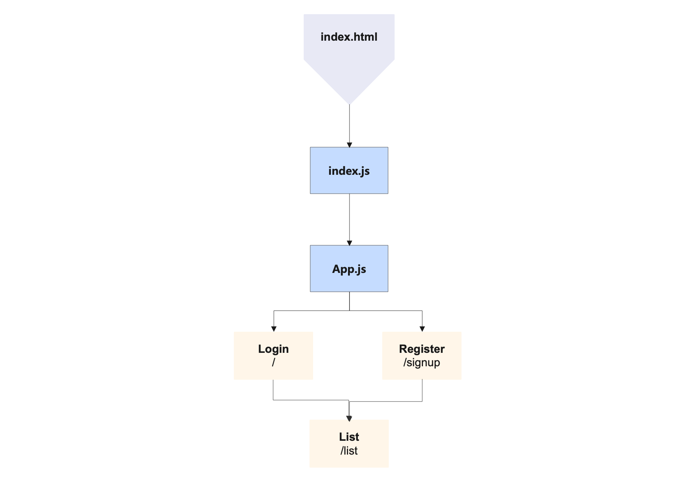

# W09D01

# User Story : 
* Register : user can not use the app without Sign Up 
* login : User can not show his list if he doesn't login 
* get : tasks will display as a list when user login in the app . 
* edit : user can modify his tasks 
* Post : user can add a new tasks 
* Delete : user can remove his tasks

# components : 
* Register 
* Login 
* List
 

# Client / Fronend : 
## React Router Routs : 
| Path     | Component      | 
| :---     |      ---:      |  
| `/`      |  Login         | 
| `signup` |  Register      | 
| `list`   |  List          | 

# UML Diagram

# Links 
* [MongoDB Doc](https://docs.mongodb.com/manual/installation/)
* [Express Doc](https://expressjs.com/en/starter/installing.html)
* [Postman Doc](https://www.postman.com/downloads/)
* [React Doc](https://reactjs.org)
* [Redux Doc](https://redux.js.org)
